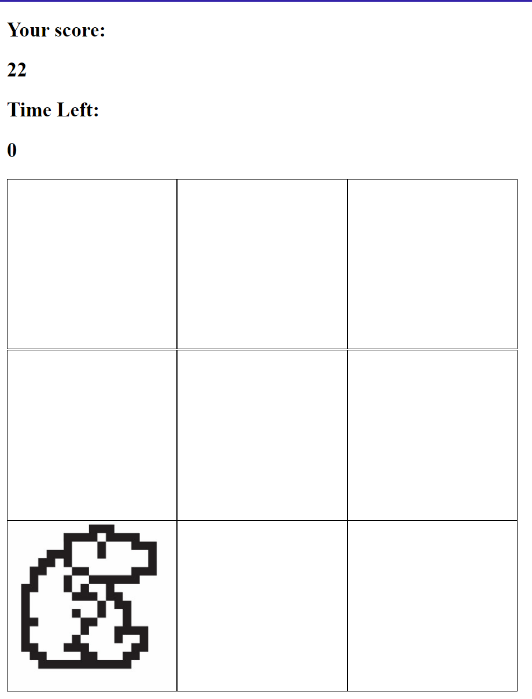
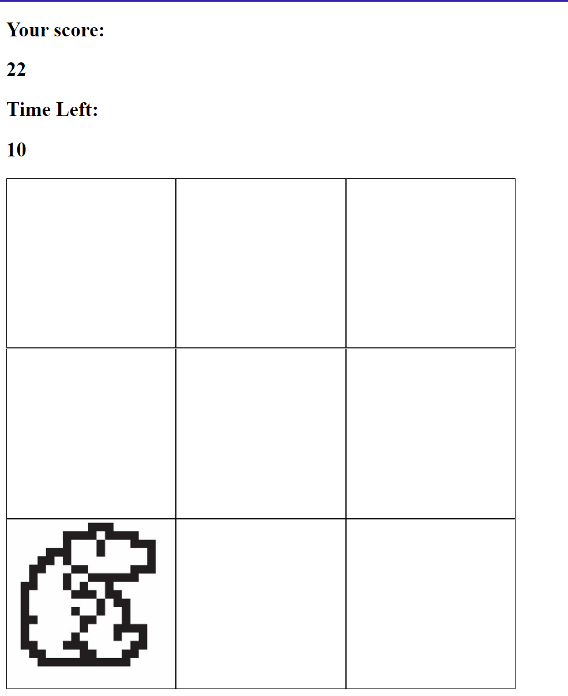

# Whack-a-Mole Game

A simple and fun grid-based **Whack-a-Mole** game created using **HTML**, **CSS**, and **JavaScript**. The player must click on the grid cells where the mole appears to score points before the timer runs out.

## Features

- **Interactive Gameplay**: Click on the cells where the mole appears to score points.
- **Responsive Grid**: The game grid adapts to different screen sizes for a seamless experience on desktop and mobile.
- **Timer**: The game has a countdown timer to limit the playing session.
- **Score Counter**: Displays the current score as the player hits the mole.

## How to Play

1. Click the **Start** button to begin the game.
2. A mole will randomly appear in one of the grid cells.
3. Click on the mole to score points.
4. The game ends when the timer runs out, and your final score is displayed.

## Demo

Check out the live demo of the project [here](https://sanskargupta0.github.io/Whac-a-mole/).



## Installation

1. Clone the repository or download the source code:
    ```bash
    git clone https://github.com/Sanskargupta0/Whac-a-mole.git
    ```

2. Navigate to the project folder:
    ```bash
    cd Whack-a-mole    ```

3. Open `index.html` in your web browser:
    ```bash
    open index.html
    ```


## Technologies Used

- **HTML5**: For the game structure and layout.
- **CSS3**: For styling the grid and responsive design.
- **JavaScript**: For the game logic, including random mole generation, score counting, and timing.

## Game Mechanics

- **Mole Appearance**: The mole will randomly appear in one of the grid cells at intervals.
- **Hit Detection**: Clicking on the mole increments the score.
- **Timer**: A countdown timer limits the game duration.
- **Score Display**: The score is updated each time the player successfully clicks on a mole.

## Future Enhancements

- **Difficulty Levels**: Add different difficulty modes (e.g., easy, medium, hard) with varied speeds for mole appearance.
- **Sound Effects**: Include sound effects for successful hits and background music.
- **Leaderboard**: Implement a leaderboard to display high scores.
- **Mobile Optimizations**: Further enhancements for a better touch-based experience.

## Screenshots

### Game Start


### Mole Appearing


## Contributing

Contributions are welcome! If you'd like to improve the game or add new features, feel free to fork the repository, make your changes, and submit a pull request.

## License

This project is licensed under the MIT License. See the [LICENSE](LICENSE) file for more details.

## Acknowledgments

- Inspired by the classic arcade game **Whack-a-Mole**.
- Thanks to the open-source community for helpful tutorials on web-based game development.

---

Enjoy playing **Whack-a-Mole** and test your reflexes! 🕹️🎉

